# Single-cell RNA-seq analysis of Tau transgenic rat hippocampus

## Project overview

This project investigates cellular and transcriptional changes associated with tauopathy using single-cell RNA sequencing (scRNA-seq) data from a Tau transgenic rat model.

The analysis was performed on hippocampal tissue collected from wild-type (WT) and Tau transgenic rats at two disease stages:

* 10 months
* 20 months

The main objectives were to:

* identify major brain cell populations,
* compare cellular composition between WT and Tau animals,
* detect differentially expressed genes (DEGs),
* characterize biological pathways associated with disease progression.

---

## Dataset

**GEO accession:** GSE305314

The dataset contains 10x Genomics single-cell RNA sequencing data generated from rat hippocampus.

Raw sequencing data are publicly available through GEO and are not included in this repository.

---

## Analysis workflow

### Quality control

Cells were filtered based on:

* number of detected genes,
* total UMI counts,
* percentage of mitochondrial transcripts.

### Preprocessing

* library size normalization,
* log-transformation,
* highly variable gene selection,
* PCA dimensionality reduction.

### Batch correction and integration

Biological replicates were integrated using **Harmony** to reduce batch effects while preserving biological variation.

### Clustering and visualization

* neighborhood graph construction,
* Leiden clustering,
* UMAP visualization.

### Cell type annotation

Clusters were annotated using canonical marker genes.

Identified cell populations included:

* Excitatory neurons
* Inhibitory neurons
* Astrocytes
* Oligodendrocytes
* OPCs
* Microglia
* Endothelial cells
* Vascular fibroblasts
* Ependymal / choroid plexus cells

### Differential expression analysis

Differentially expressed genes were identified between Tau and WT animals within selected cell populations using the Wilcoxon rank-sum test.

### Functional enrichment analysis

Functional enrichment was performed using:

* g:Profiler
* GSEApy

to identify significantly enriched biological processes and pathways associated with disease-related transcriptional changes.

---

# Key Results

## Cell type identification

Major hippocampal cell populations were successfully identified using canonical marker genes and manual cluster annotation.

### 10-month cohort

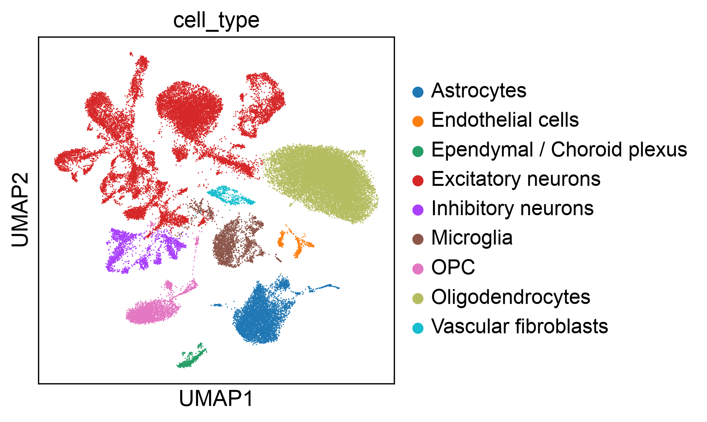

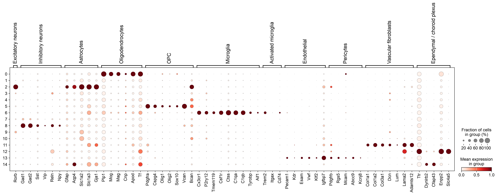

### 20-month cohort

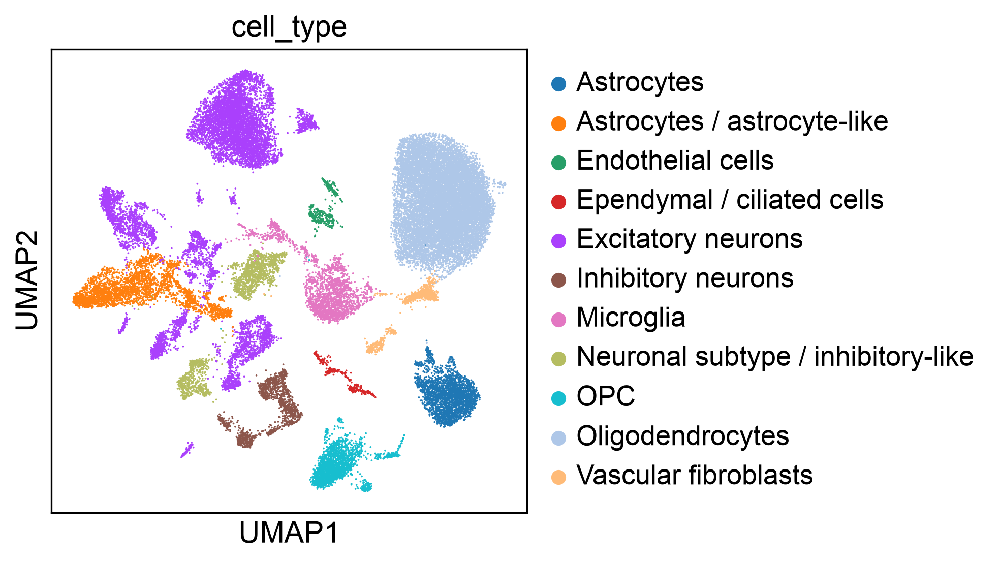

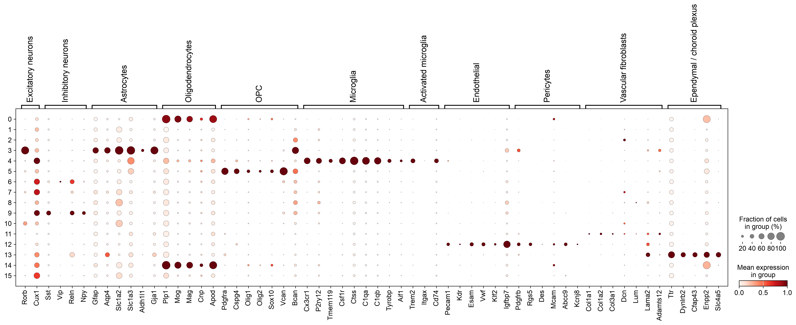

Both cohorts showed clear separation of major neural and glial populations. Cell type annotation was supported by established marker genes, including neuronal, astrocytic, oligodendroglial, microglial, endothelial and ependymal markers.

---

## Integration quality

Harmony integration resulted in good mixing of biological replicates within shared cellular populations.

### 10-month cohort

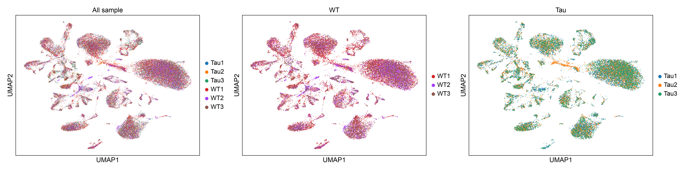

### 20-month cohort

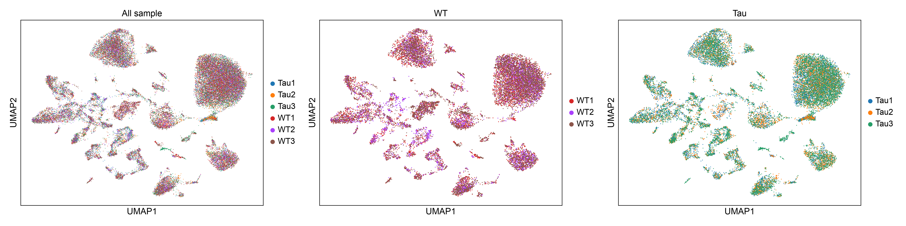

The absence of strong sample-specific clustering suggests successful correction of batch effects while maintaining biologically meaningful structure.

---

## Cell type composition

### 10-month cohort

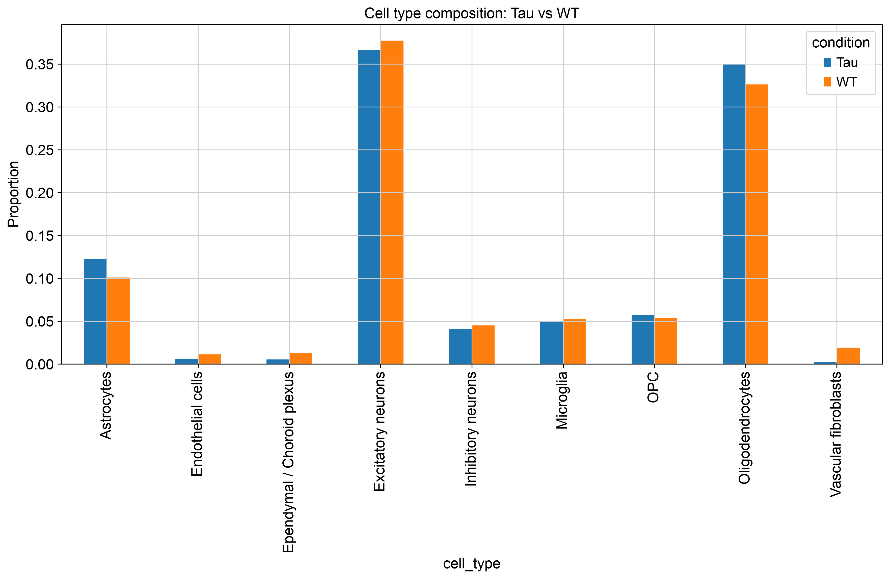

### 20-month cohort

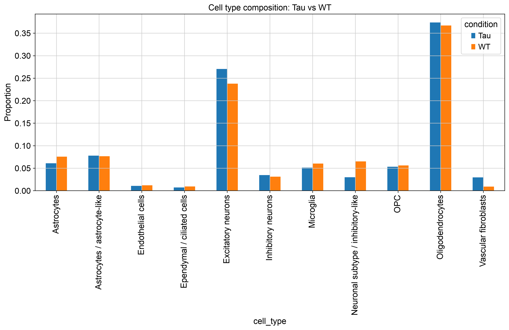

Cellular composition remained broadly similar between WT and Tau animals in both cohorts.

However, the 20-month cohort showed more noticeable differences in the proportions of several populations, including excitatory neurons, oligodendrocytes and vascular fibroblasts, suggesting progressive cellular remodeling during disease progression.

---

## Differential expression analysis

Differential expression analysis was performed separately for selected cell populations.

### 10-month cohort

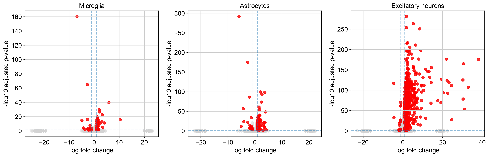

### 20-month cohort

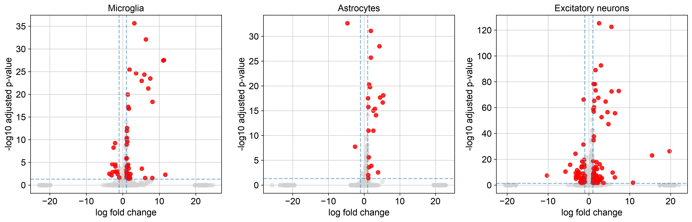

The strongest transcriptional alterations were observed in:

* Microglia
* Astrocytes
* Excitatory neurons

Compared with the 10-month cohort, the 20-month cohort displayed more pronounced differential expression signatures, indicating progression of disease-associated transcriptional changes.

---

## Functional enrichment analysis

### 10-month cohort


### 20-month cohort

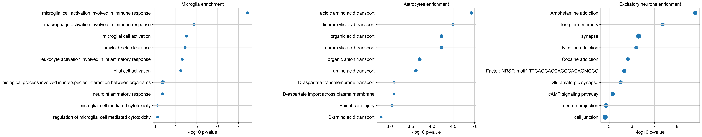

Enrichment analysis revealed biologically meaningful pathways across multiple cell populations.

### Microglia

Enriched pathways were primarily related to:

* microglial activation,
* inflammatory response,
* immune signaling,
* amyloid-beta clearance.

### Astrocytes

Enriched pathways were associated with:

* amino acid transport,
* organic acid transport,
* metabolic regulation.

### Excitatory neurons

Enriched pathways included:

* synaptic signaling,
* glutamatergic transmission,
* neuronal communication,
* memory-related processes.

---

## Comparison of 10- and 20-month cohorts

The 10-month cohort showed relatively preserved cellular composition and moderate transcriptional differences between Tau and WT animals.

In contrast, the 20-month cohort displayed:

* increased cellular heterogeneity,
* more pronounced differences in cell-type proportions,
* stronger differential expression signatures.

Across both disease stages, microglia consistently exhibited activation of immune and inflammatory pathways, while astrocytes showed alterations in metabolic transport processes and excitatory neurons displayed changes in synaptic and neuronal signaling pathways.

Together, these findings are consistent with progressive neuroinflammatory activation and neuronal dysfunction during tauopathy progression.

---

## Software

* Python 3.11
* Scanpy
* AnnData
* HarmonyPy
* Leidenalg
* UMAP
* GSEApy
* g:Profiler
* Pandas
* NumPy
* SciPy
* Matplotlib
* Seaborn

---

## Reproducibility

The repository contains:

* `requirements.txt` – core project dependencies
* `requirements_full.txt` – full environment snapshot
* `sessionInfo.txt` – software versions used during the analysis

---

## Repository structure

```text
.
├── notebooks/
│   ├── GSE305314_10mo.ipynb
│   └── GSE305314_20mo.ipynb
│
├── Figures/
│   ├──figures_10mo/
│   │   ├── 1_UMAP_sample_10mo.png
│   │   ├── 2_Brain_markers_10mo.png
│   │   ├── 3_UMAP_cell_type_10mo.png
│   │   ├── 4_Cell_type_composition_10mo.png
│   │   ├── 5_DEGs_all_celltypes_10mo.png
│   │   └── 6_Enrichment_all_celltypes_10mo.png
│   └──figures_20mo/
│       ├── 1_UMAP_sample_20mo.png
│       ├── 2_Brain_markers_20mo.png
│       ├── 3_UMAP_cell_type_20mo.png
│       ├── 4_Cell_type_composition_20mo.png
│       ├── 5_DEGs_all_celltypes_20mo.png
│       └── 6_Enrichment_all_celltypes_20mo.png
│
├── requirements.txt
├── requirements_full.txt
├── sessionInfo.txt
└── README.md
```

---

## Author

**Dominika Brosch**

#### LinkedIn:
https://www.linkedin.com/in/dominika-brosch-9bb362267
